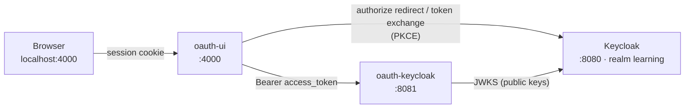
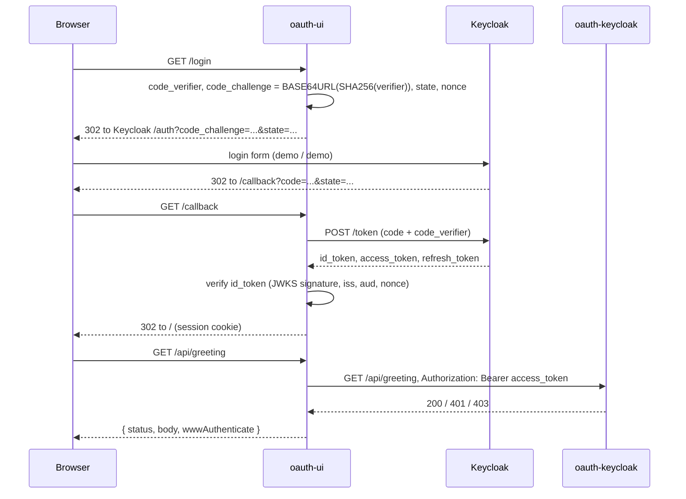

# <span style="color:hsl(55,80%,50%)">oauth-ui — OAuth 2.0 Authorization Code + PKCE client</span>

## <span style="color:hsl(141,80%,58%)">Table of contents</span>

1. 🎯 [Overview](#overview)
2. 📋 [Prerequisites](#prerequisites)
3. 🚀 [Start everything](#start-everything)
    - 3.1 [Start Keycloak](#start-keycloak)
    - 3.2 [Start oauth-keycloak](#start-oauth-keycloak)
    - 3.3 [Start oauth-ui](#start-oauth-ui)
    - 3.4 [Log in and call the API](#log-in-and-call-the-api)
    - 3.5 [Stop everything](#stop-everything)
4. 📜 [npm scripts](#npm-scripts)
5. ⚙️ [Configuration](#configuration)
6. 🔌 [Endpoints](#endpoints)
7. 🔐 [What happens on login, step by step](#login-flow)
8. ✅ [Check it from the command line](#command-line-checks)
9. 🩺 [Troubleshooting](#troubleshooting)

<a id="overview"></a>
## <span style="color:hsl(278,80%,58%)">1. 🎯 Overview</span>

`oauth-ui` is the **OAuth client** of this project. It is an Express server (backend-for-frontend)
plus one static page (`public/index.html`). It:

- logs the user in through **Keycloak** with the **Authorization Code flow + PKCE** (`S256`),
- verifies the **ID token** (signature, `iss`, `aud`, `nonce`) with [`jose`](https://github.com/panva/jose),
- keeps all tokens **server side** in the session (the browser only gets an `httpOnly` session cookie),
- calls **`oauth-keycloak`** (`GET /api/greeting`) with `Authorization: Bearer <access_token>`,
- refreshes the access token with the refresh token when it is about to expire,
- logs out of both the app and the Keycloak SSO session (RP-initiated logout).

The OAuth flow is written by hand in [`server.js`](server.js) (no OIDC client library) so every step is readable.



| File | Purpose |
|---|---|
| `server.js` | Login, callback, token refresh, API proxy, logout |
| `public/index.html` | The single page: login button, API response, PKCE values, token claims |
| `package.json` | Dependencies (`express`, `express-session`, `jose`) and npm scripts |
| `.env.example` | All settings with their defaults; copy to `.env` to override |

<a id="prerequisites"></a>
## <span style="color:hsl(193,80%,58%)">2. 📋 Prerequisites</span>

| Tool | Version | Check |
|---|---|---|
| Node.js | **22.9+** (`--env-file-if-exists` flag) | `node -v` |
| npm | comes with Node | `npm -v` |
| Docker + Docker Compose v2 | recent (for Keycloak) | `docker compose version` |
| Java (JDK) | **27** (for oauth-keycloak) | `java -version` |

Free ports: **4000** (oauth-ui), **8080** (Keycloak), **8081** (oauth-keycloak).

<a id="start-everything"></a>
## <span style="color:hsl(331,80%,58%)">3. 🚀 Start everything</span>

oauth-ui needs Keycloak to log in and oauth-keycloak to call. Start them in this order, each in its own terminal.
All commands run from the **repo root** (`learning-oauth/`) unless a `cd` is shown.

<a id="start-keycloak"></a>
### <span style="color:hsl(20,80%,58%)">3.1 Start Keycloak</span>

```bash
cd oauth-keycloak/keycloak
docker compose up -d
docker compose logs -f keycloak    # wait for "Listening on: http://0.0.0.0:8080", then Ctrl+C
```

The first start pulls the image (~30-60 s). The realm `learning`, the client `node-pkce-app`
and the users `demo` / `noaccess` are imported from `realm-export.json` on startup.

Check: http://localhost:8080/realms/learning/.well-known/openid-configuration returns JSON.

<a id="start-oauth-keycloak"></a>
### <span style="color:hsl(80,80%,50%)">3.2 Start oauth-keycloak</span>

```bash
./mvnw -pl oauth-keycloak spring-boot:run
```

Check: `curl http://localhost:8081/actuator/health` returns `{"status":"UP"}`.

<a id="start-oauth-ui"></a>
### <span style="color:hsl(300,70%,60%)">3.3 Start oauth-ui</span>

```bash
cd oauth-ui
npm install        # first time only
npm start          # or: npm run dev  (restarts on file changes)
```

Expected output:

```
App:      http://localhost:4000
Keycloak: http://localhost:8080/realms/learning
API:      http://localhost:8081
```

No `.env` is needed for the default ports. See [Configuration](#configuration) to change them.

<a id="log-in-and-call-the-api"></a>
### <span style="color:hsl(165,80%,45%)">3.4 Log in and call the API</span>

Open **http://localhost:4000** and click **Login with Keycloak**.

| User | Password | Has `api-user` role | API result shown on the page |
|---|---|---|---|
| `demo` | `demo` | yes | **200** greeting + the token details the API saw |
| `noaccess` | `noaccess` | no | **403** `insufficient_scope` (logged in, but not allowed) |

After login the page shows, top to bottom: the **oauth-keycloak response** (called automatically),
the PKCE values used, token metadata, the verified ID token claims and the decoded access token claims.
**Call oauth-keycloak again** repeats the API call. **Logout** ends both the app session and the Keycloak session.

<a id="stop-everything"></a>
### <span style="color:hsl(45,80%,50%)">3.5 Stop everything</span>

- oauth-ui and oauth-keycloak: `Ctrl+C` in their terminals.
- Keycloak: `cd oauth-keycloak/keycloak && docker compose down`.

Sessions are kept in memory, so restarting oauth-ui logs everyone out.

<a id="npm-scripts"></a>
## <span style="color:hsl(56,80%,50%)">4. 📜 npm scripts</span>

| Command | Runs | Use |
|---|---|---|
| `npm start` | `node --env-file-if-exists=.env server.js` | Normal run; loads `.env` if present |
| `npm run dev` | `node --env-file-if-exists=.env --watch server.js` | Same, restarts on file changes |

<a id="configuration"></a>
## <span style="color:hsl(0,80%,58%)">5. ⚙️ Configuration</span>

Works with no configuration. To override, copy the example file and edit it:

```bash
cp .env.example .env
```

`.env` is git-ignored and loaded automatically by both npm scripts. Plain environment variables work too,
e.g. `PORT=5000 APP_BASE_URL=http://localhost:5000 npm start`.

| Variable | Default | Notes |
|---|---|---|
| `PORT` | `4000` | Port oauth-ui listens on |
| `APP_BASE_URL` | `http://localhost:4000` | Builds `redirect_uri` (`<base>/callback`) and the post-logout URI |
| `KEYCLOAK_URL` | `http://localhost:8080` | Keycloak base URL |
| `KEYCLOAK_REALM` | `learning` | Realm; issuer is `<KEYCLOAK_URL>/realms/<realm>` |
| `KEYCLOAK_CLIENT_ID` | `node-pkce-app` | Public client (no secret; PKCE protects the code) |
| `SESSION_SECRET` | `dev-only-secret` | Signs the session cookie; set a long random value outside local dev |
| `API_URL` | `http://localhost:8081` | Base URL of oauth-keycloak |

> **Changing the port or URL?** Keycloak only redirects to URLs it knows. Update `redirectUris`,
> `webOrigins`, `rootUrl` and `post.logout.redirect.uris` in `oauth-keycloak/keycloak/realm-export.json`,
> then recreate Keycloak (`docker compose down && docker compose up -d`).

<a id="endpoints"></a>
## <span style="color:hsl(200,80%,58%)">6. 🔌 Endpoints</span>

| Method | Path | Description |
|---|---|---|
| GET | `/` | Single page UI (`public/index.html`) |
| GET | `/login` | Creates `code_verifier`, `code_challenge`, `state`, `nonce`; redirects to Keycloak |
| GET | `/callback` | Redirect URI: checks `state`, exchanges `code` + `code_verifier` for tokens, verifies the ID token |
| GET | `/api/me` | `{ authenticated, user, accessTokenClaims, token, pkce }` for the page |
| GET | `/api/greeting` | Calls oauth-keycloak with the session's access token; returns `{ request, status, wwwAuthenticate, body }` |
| GET | `/logout` | Destroys the session and redirects to Keycloak's `end_session_endpoint` |

<a id="login-flow"></a>
## <span style="color:hsl(141,80%,58%)">7. 🔐 What happens on login, step by step</span>



1. **Discovery.** On first use, oauth-ui reads `<issuer>/.well-known/openid-configuration` to find the authorization, token, JWKS and logout endpoints.
2. **`/login`.** Generates a random `code_verifier` and its `S256` `code_challenge`, plus `state` (CSRF) and `nonce` (replay). Stores them in the session and redirects to Keycloak with the challenge only.
3. **User logs in at Keycloak.** Keycloak remembers the challenge and redirects back with a one-time `code`.
4. **`/callback`.** Rejects a mismatched `state`, then POSTs `code` + `code_verifier` to the token endpoint. Keycloak hashes the verifier and compares it with the stored challenge, so a stolen `code` alone is useless.
5. **ID token verification.** Signature via JWKS, `iss`, `aud == node-pkce-app`, and `nonce`. The session is regenerated (prevents session fixation) and tokens are stored in it.
6. **`/api/greeting`.** If the access token expires within 10 s it is refreshed first (`grant_type=refresh_token`), then sent to oauth-keycloak as a Bearer token. The browser never sees it.
7. **`/logout`.** Destroys the session and redirects to Keycloak's logout with `id_token_hint`, which ends the SSO session and returns to `/`.

<a id="command-line-checks"></a>
## <span style="color:hsl(30,80%,55%)">8. ✅ Check it from the command line</span>

```bash
curl -s http://localhost:4000/api/me            # {"authenticated":false} before login
curl -si http://localhost:4000/login | head -5  # 302 Location: http://localhost:8080/realms/learning/protocol/openid-connect/auth?...
curl -s http://localhost:4000/api/greeting      # {"error":"not logged in"} (401)
```

<a id="troubleshooting"></a>
## <span style="color:hsl(170,75%,48%)">9. 🩺 Troubleshooting</span>

| Symptom | Cause / fix |
|---|---|
| `node: bad option: --env-file-if-exists=.env` | Node older than 22.9. Upgrade Node (`node -v`). |
| `OIDC discovery failed … (is Keycloak running?)` | Keycloak not up yet: `docker compose ps`, `docker compose logs keycloak` in `oauth-keycloak/keycloak`. |
| Keycloak page: **Invalid parameter: redirect_uri** | `APP_BASE_URL`/`PORT` don't match `redirectUris` in the realm. See [Configuration](#configuration). |
| `No login in progress` after login | oauth-ui restarted mid-login (sessions are in memory), or the session cookie was blocked. Start again. |
| `State mismatch - possible CSRF` | Two logins in parallel tabs, or a stale Keycloak tab. Start again from `/`. |
| Page shows `oauth-keycloak not reachable at http://localhost:8081` (502) | oauth-keycloak not running: `./mvnw -pl oauth-keycloak spring-boot:run` from the repo root. |
| API result 401 `invalid_token` | Issuer/audience mismatch on the API side; see the [root README troubleshooting](../README.md#troubleshooting). |
| API result 403 for `demo` | Realm import didn't assign `api-user`. Check Users → demo → Role mapping in Keycloak, then log in again. |
| `session expired, please log in again` | Refresh token expired (SSO session ended). Log in again. |
| `EADDRINUSE :::4000` | Port taken: `PORT=5000 APP_BASE_URL=http://localhost:5000 npm start` and update the realm URLs. |
